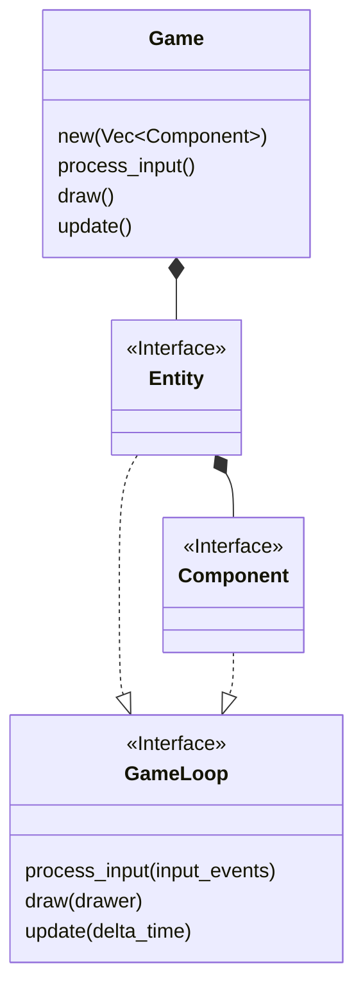

```mermaid
classDiagram
  class GameLoop
  <<Interface>> GameLoop
  GameLoop: process_input(input_events)
  GameLoop: draw(drawer)
  GameLoop: update(delta_time)

  class Game
  Game *-- Entity
  Game: new(Vec~Component~)
  Game: process_input()
  Game: draw()
  Game: update()

  class Entity
  <<Interface>> Entity 
  Entity *-- Component
  Entity ..|>GameLoop

  class Component
  <<Interface>> Component
  Component ..|>GameLoop

  


```
